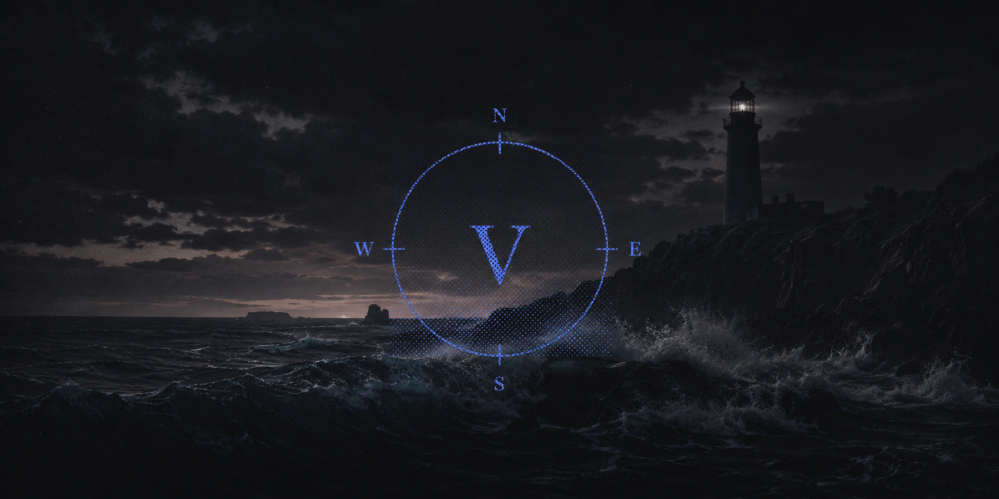
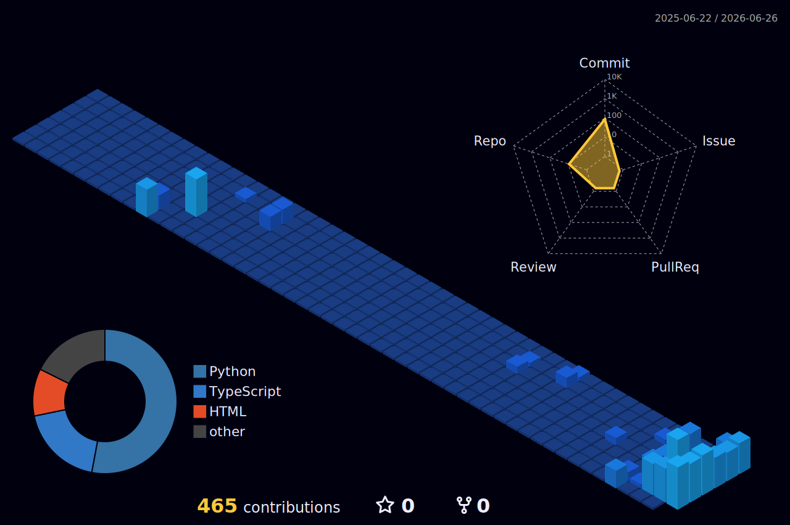

<p align="center">
  
</p>

```
$ whoami

name:     Varun Bhambri
role:     indie developer
origin:   mariner
current:  engineer
handle:   0xvarunb
base:     Earth (Sometimes Sea)

~/waypoint     main
```

[](https://git.io/typing-svg)

---

## Projects

- **cc-world**: India's most exhaustive credit-card points optimizer. Earn and burn, optimally.
- **etf-kidukaan**: opinionated toolkit for scanning and backtesting NSE-listed ETFs near 52-week lows.
- **Nifty-weekly**: NIFTY hourly-close scanner that pings the moment a Supertrend + EMA(20) setup triggers.
- **homma_genius**: Telegram bot that runs a daily Homma weekly-status workflow for select Indian ETFs.

## Repos worth a look

<table>
  <tr>
    <td>
      <a href="https://github.com/0xvarunb/cc-world">
        
      </a>
    </td>
    <td>
      <a href="https://github.com/0xvarunb/homma_genius">
        
      </a>
    </td>
  </tr>
  <tr>
    <td>
      <a href="https://github.com/0xvarunb/etf-kidukaan">
        
      </a>
    </td>
    <td>
      <a href="https://github.com/0xvarunb/Nifty-weekly">
        
      </a>
    </td>
  </tr>
</table>

## Receipts

<picture>
  <source media="(prefers-color-scheme: dark)" srcset="https://raw.githubusercontent.com/0xvarunb/0xvarunb/output/github-contribution-grid-snake-dark.svg" />
  <source media="(prefers-color-scheme: light)" srcset="https://raw.githubusercontent.com/0xvarunb/0xvarunb/output/github-contribution-grid-snake.svg" />
  
</picture>



<table>
  <tr>
    <td>
      
    </td>
    <td>
      
    </td>
  </tr>
</table>

[](https://github.com/ashutosh00710/github-readme-activity-graph)

---

<p align="center">
  <em>Earth. Sometimes Sea.</em>
</p>
